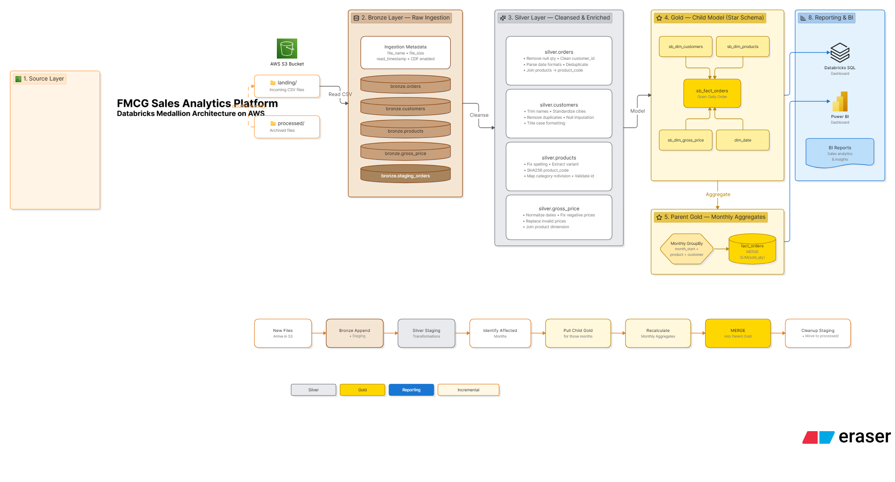

# 🏏 End-to-End Data Engineering Project — FMCG Domain (Databricks)

<p align="center">
  
</p>

<p align="center">
  
  
  
  
  
  
</p>

<p align="center">
  <strong>Medallion Architecture · Multi-Tenant Design · Incremental Loading · Real-Time Dashboard</strong>
</p>

---

## 📋 Table of Contents

- [Project Overview](#-project-overview)
- [Business Problem](#-business-problem)
- [Architecture](#-architecture)
- [Tech Stack](#️-tech-stack)
- [Data Pipeline Layers](#-data-pipeline-layers)
- [Repository Structure](#-repository-structure)
- [Key Engineering Decisions](#-key-engineering-decisions)
- [Dashboard & Business Impact](#-dashboard--business-impact)
- [How to Run](#-how-to-run)
- [What I Learned](#-what-i-learned)
- [Roadmap](#-roadmap)

---

## 🎯 Project Overview

A **production-grade, end-to-end data engineering pipeline** built for **Sports Bar**, a fast-growing startup in the **energy bars and athletic nutrition space**, recently acquired by **Atlon** — a leading manufacturer of sports equipment operating across several countries.

The pipeline ingests raw transactional data (orders, customers, products, pricing) from **AWS S3**, processes it through **Bronze → Silver → Gold** layers using **PySpark on Databricks**, and merges analytics-ready data into a **shared parent company Gold layer** via a **multi-tenant architecture**. The final output powers a **live Databricks dashboard** with Databricks Genie AI integration for natural language querying.

### 📊 Pipeline Output — Business Metrics Tracked

| Metric | Value |
|---|---|
| 💰 Total Revenue | ₹119.8 Crore (₹119,826,118,492) |
| 📦 Total Units Sold | 38.27 Million |
| 🛒 Average Order Value | ₹11,84,287 |
| 📋 Total Orders Processed | 1,01,180 |

---

## 💼 Business Problem

**Atlon**, a leading manufacturer of sports equipment, acquired **Sports Bar**, a fast-growing startup in the energy bars and athletic nutrition space. Atlon already had a mature, well-established analytics Gold layer. The challenge:

> *How do you onboard a new child company into an existing analytics ecosystem — with different data schemas, messy data quality, missing months of data, and daily-vs-monthly grain mismatch — without disrupting the parent's reporting?*

Sports Bar's data was scattered across spreadsheets, cloud drives, and hastily built APIs. Their data formats didn't match Atlon's. Reporting cycles didn't align. Some months of Sports Bar data simply didn't exist — lost during their hyper-growth phase.

**Solution:** Build an isolated Bronze → Silver → Gold pipeline for Sports Bar that:
1. Cleans and standardizes child data independently (no parent dependency)
2. Generates consistent surrogate keys that join safely with the parent schema
3. Aggregates child daily data to monthly grain at the merge step
4. Merges into the Atlon Gold layer via **Delta MERGE (upsert)** — idempotent and safe

---

## 🏗️ Architecture

<p align="center">
  
</p>

The pipeline follows a **6-stage Medallion Architecture** with multi-tenant design:

```
S3 (RAW Data)
    │
    ▼
[Stage 1] AWS S3 Landing Zone
    CSV files for: orders, customers, products, gross_price
    Archive pattern: landing/ → processed/ after ingestion
    │
    ▼
[Stage 2] Lakeflow Jobs on Databricks
    Orchestrates PySpark notebook execution & scheduling
    │
    ▼
[Stage 3] Bronze Layer  (fmcg.bronze.*)
    Raw ingestion with metadata columns
    Change Data Feed (CDF) enabled
    Archive pattern applied
    │
    ▼
[Stage 4] Silver Layer  (fmcg.silver.*)
    Data quality fixes, deduplication
    Typo corrections (cities, spellings)
    SHA-256 product codes
    Multi-format date parsing
    Delta MERGE upserts
    │
    ▼
[Stage 5] Child Gold Layer  (fmcg.gold.sb_*)
    Analytics-ready fact & dimension tables
    sb_fact_orders, sb_dim_customers, sb_dim_products, sb_dim_gross_price
    │
    ▼ [Delta MERGE — daily → monthly aggregation]
[Stage 6] Parent Gold Layer  (fmcg.gold.*)
    fact_orders, dim_customers, dim_products, dim_gross_price, dim_date
    Merged from all child companies
    │
    ▼
[Serving Layer]
    Databricks Dashboard  (live KPIs, charts, interactive filters)
    Databricks Genie AI (natural language querying)
```

**Key Design Principle:** Child companies maintain full data autonomy at Bronze and Silver layers. The merge into the Atlon Gold layer only happens after data has been cleaned, validated, and standardized — ensuring the parent layer always contains trustworthy, analytics-ready data.

> **Note:** Atlon's Bronze and Silver pipeline is assumed to already exist and is out of scope for this project. Historical data for Atlon is loaded directly into the Gold layer from CSV. This project focuses entirely on building Sports Bar's pipeline and merging it into the shared Gold layer.

---

## 🛠️ Tech Stack

| Tool | Role |
|---|---|
| **Apache PySpark** | Distributed data processing — all transformations across Bronze, Silver, Gold |
| **Databricks** | Unified analytics platform — notebook orchestration, cluster management |
| **Delta Lake** | ACID transactions, MERGE upserts, Change Data Feed, Time Travel |
| **AWS S3** | Raw data storage — landing zone for CSVs, archive for processed files |
| **Unity Catalog** | Centralized data governance — multi-tenant catalog with namespace isolation |
| **Lakeflow Jobs** | Pipeline orchestration — scheduling and dependency management across layers |
| **Databricks Dashboard** | Business intelligence serving layer — live KPIs, charts, interactive filters |
| **Databricks Genie** | AI-powered natural language querying on Gold layer data |

---

## 📦 Data Pipeline Layers

### 🥉 Bronze Layer — Raw Ingestion

| Step | Detail |
|---|---|
| **Source** | `s3://sportsbar-final/<entity>/landing/*.csv` |
| **Read** | `spark.read.csv` with `inferSchema=True` |
| **Metadata** | `read_timestamp`, `file_name`, `file_size` via `_metadata` |
| **Write (Dimensions)** | Overwrite `fmcg.bronze.<entity>` Delta table |
| **Write (Fact — Orders)** | Append to `fmcg.bronze.orders` Delta table |
| **CDF** | `delta.enableChangeDataFeed = true` on all Bronze tables |
| **Archive** | Files moved `landing/` → `processed/` via `dbutils.fs.mv` |

### 🥈 Silver Layer — Cleaned & Transformed

**Orders:**
- Null `order_qty` rows filtered out
- Non-numeric `customer_id` → fallback `"999999"`
- Weekday prefix stripped from dates (`"Tuesday, July 01, 2025"` → `"July 01, 2025"`)
- Multi-format date parsing via `F.coalesce + F.try_to_date` (4 formats)
- Deduplication on `[order_id, date, customer_id, product_id, order_qty]`
- Join with Silver products to attach `product_code`
- Delta MERGE upsert into Silver orders

**Customers:**
- Duplicate `customer_id` rows dropped (39 raw → 35 after dedup)
- Whitespace trimmed from `customer_name`
- 7 city typos corrected: `Bengaluruu → Bengaluru`, `NewDheli → New Delhi`, `Hyderbad → Hyderabad`, etc.
- Title-case fix via `F.initcap`
- 4 customers with missing cities manually confirmed with business team and patched
- Derived columns: `market = "India"`, `platform = "Sports Bar"`, `channel = "Acquisition"`
- `customer_name` concatenated with `city` to disambiguate customers across locations

**Products:**
- Deduplication on `product_id` (2 duplicate records dropped)
- Title-case fix on `category`
- Spelling fix: `Protien → Protein` via `regexp_replace` (case-insensitive)
- Non-numeric `product_id` values replaced with fallback `"999"` (per business rule: valid product IDs must be numeric)
- `division` derived from category (6 business categories → 6 division labels)
- `variant` extracted from `product_name` via regex `\((.*?)\)` (text inside parentheses)
- `product_code` = `SHA-256(product_name)` — deterministic, collision-resistant surrogate key (replaces unreliable `product_id`)

**Gross Price:**
- `month` parsed from 4 date formats via `F.coalesce + F.try_to_date`
- Negative `gross_price` made positive via `× -1`; non-numeric (e.g. "unknown") → `0`
- Joined with Silver products to attach `product_code`
- Price aggregated at yearly grain via `Window(partitionBy product_code + year, orderBy gross_price DESC)`
- Latest non-zero price selected per product per year

### 🥇 Gold Layer — Analytics-Ready

**Child Gold Tables (`fmcg.gold.sb_*`):**

| Table | Key Columns | Description |
|---|---|---|
| `sb_fact_orders` | `order_id, date, customer_code, product_code, sold_quantity` | Daily fact — one row per order line |
| `sb_dim_customers` | `customer_code, customer_name, city, market, platform, channel` | Customer master |
| `sb_dim_products` | `product_code, product_name, category, division, variant` | Product master |
| `sb_dim_gross_price` | `product_code, fiscal_year, gross_price` | Yearly price reference |

**Parent Gold Tables (`fmcg.gold.*`):**

| Table | Grain | Merge Key |
|---|---|---|
| `fact_orders` | Month × product_code × customer_code | `date + product_code + customer_code` |
| `dim_customers` | One row per customer | `customer_code` |
| `dim_products` | One row per product | `product_code` |
| `dim_gross_price` | Product × fiscal year | `product_code + fiscal_year` |
| `dim_date` | One row per month (2024–2025) | `date_key` |

---

## 📁 Repository Structure

```
sports-analytics-pipeline/
│
├── README.md                          # This file
├── requirements.txt                   # Environment & dependencies
├── .gitignore
│
├── notebooks/
│   ├── 1_setup/
│   │   ├── setup_catalog.ipynb        # Create Unity Catalog, schemas
│   │   └── utilities.ipynb            # Shared schema name constants
│   │
│   ├── 2_dimensions/
│   │   ├── 1_customers_data_processing.ipynb   # Bronze→Silver→Gold customers
│   │   ├── 2_products_data_processing.ipynb    # Bronze→Silver→Gold products
│   │   ├── 3_pricing_data_processing.ipynb     # Bronze→Silver→Gold gross price
│   │   └── 4_dim_date_table_creation.ipynb     # Static date dimension (2024–2025)
│   │
│   ├── 3_fact_orders/
│   │   ├── 1_full_load_fact.ipynb              # Full historical load strategy
│   │   └── 2_incremental_load_fact.ipynb       # Incremental load with staging tables
│   │
│   └── 4_gold_parent/
│       └── (parent merge logic embedded in dimension & fact notebooks)
│
├── sql/
│   ├── 01_setup_catalog.sql           # Unity Catalog & schema creation DDL
│   └── 02_create_parent_gold_tables.sql # Parent Gold layer table definitions
│
├── architecture/
│   └── design_decisions.md            # Engineering decisions & rationale (ADRs)
│
└── docs/
    └── images/
        ├── architecture.png            # System architecture diagram
        └── dashboard_screenshot.png    # Databricks dashboard screenshot
```

---

## ⚙️ Key Engineering Decisions

### 1. SHA-256 as Product Surrogate Key
Raw `product_id` from Sports Bar's source is unreliable — it contained non-numeric and invalid values, with invalid entries replaced by a fallback of `"999"`. `SHA-256(product_name)` provides a **deterministic, collision-resistant surrogate key** that survives source system issues, avoids primary key collisions from fallback values, and works consistently across all child companies.

### 2. Delta MERGE (Upsert) Everywhere
Safer than `overwrite` for production pipelines. Handles late-arriving data gracefully, ensures **idempotency** without data loss, and works atomically — a failed mid-run MERGE doesn't leave the table in a broken state.

### 3. Staging Table Pattern for Incremental Efficiency
Only newly landed files are written to a `staging_<table>` Delta table. Transformations operate on this tiny staging dataset instead of reprocessing the full Bronze/Silver history — **reducing compute cost on every incremental run**.

### 4. Monthly Grain Aggregation at Merge Step
Atlon needs cross-brand monthly reporting; Sports Bar's child data is at daily granularity. Aggregation happens **at the merge step, not at storage** — keeping child data granular and auditable while feeding the parent layer the correct grain. All December daily records are summed per `product_code + customer_code` before upserting into the parent `fact_orders` table.

### 5. Change Data Feed (CDF) Enabled
All Delta tables have CDF enabled, allowing downstream consumers to track **row-level inserts, updates, and deletes** — critical for audit trails, CDC pipelines, and incremental dashboard refresh.

### 6. Fallback Sentinel Values for Bad Data
`customer_id` → `"999999"`, `product_id` → `"999"`, and `gross_price` → `0` for non-numeric or invalid inputs. **Keeps the pipeline running without data loss**; bad records are isolable via sentinel values for later review.

For full ADR documentation, see [`architecture/design_decisions.md`](architecture/design_decisions.md).

---

## 📊 Dashboard & Business Impact

<p align="center">
  
</p>

**Live Databricks dashboard** connected directly to `fmcg.gold.*` via a denormalized Gold view joining all fact and dimension tables:

| KPI | Value |
|---|---|
| Total Revenue | ₹119.8 Crore |
| Total Quantity Sold | 38.27M units |
| Avg Order Value | ₹11,84,287 |
| Total Orders | 1,01,180 |

**Dashboard Features:**
- Top 10 Categories by Revenue (donut chart)
- Top 10 Customers by Revenue (bar chart)
- Top 10 Products by Revenue (horizontal bar)
- Interactive filters: Market, Category, Year, Quarter, Month, Channel
- **Databricks Genie AI** — natural language querying for non-technical stakeholders

**Top Revenue Customers:** FitnessWorld, FastTrack Sports, Fitness Mania, Active Sport Shop, SportsMart

**Top Revenue Products (Atlon):** PX Grip Cricket Batting Gloves, WL Hex Dumbbell, NX Pro Cricket Leg Guards, RX Sprint Football Boots

---

## 🚀 How to Run

### Prerequisites
- Databricks workspace (Free Edition is sufficient) with Unity Catalog enabled
- AWS S3 bucket with source CSV files at `s3://<your-bucket>/<entity>/landing/`
- Databricks cluster (Runtime 14.x+ recommended)

### Step 1: Clone the Repository

```bash
git clone https://github.com/<your-username>/sports-analytics-pipeline.git
```

### Step 2: Import Notebooks to Databricks

1. In your Databricks workspace, go to **Workspace → Import**
2. Upload all `.ipynb` files from the `notebooks/` folder, preserving the folder structure
3. Recommended path: `/Workspace/consolidated_pipeline/`

### Step 3: Set Up Unity Catalog

Run the SQL in `sql/01_setup_catalog.sql` in a Databricks SQL notebook or the SQL editor:

```sql
CREATE CATALOG IF NOT EXISTS fmcg;
CREATE SCHEMA IF NOT EXISTS fmcg.bronze;
CREATE SCHEMA IF NOT EXISTS fmcg.silver;
CREATE SCHEMA IF NOT EXISTS fmcg.gold;
```

### Step 4: Create Parent Gold Tables

Run `sql/02_create_parent_gold_tables.sql` to create the Atlon parent-level Delta tables and manually import the parent company's historical CSV data into the Gold layer.

### Step 5: Run Setup Notebooks

```
1_setup/setup_catalog.ipynb   → Verify catalog & schemas
1_setup/utilities.ipynb       → Sets bronze_schema, silver_schema, gold_schema constants
```

### Step 6: Run Dimension Pipelines (in order)

```
2_dimensions/1_customers_data_processing.ipynb
2_dimensions/2_products_data_processing.ipynb
2_dimensions/3_pricing_data_processing.ipynb
2_dimensions/4_dim_date_table_creation.ipynb
```

### Step 7: Run Fact Table Pipeline

**First run (full historical load — July to November):**
```
3_fact_orders/1_full_load_fact.ipynb
```

**Subsequent runs (daily incremental — December onwards):**
```
3_fact_orders/2_incremental_load_fact.ipynb
```

### Step 8: Set Up Orchestration (Lakeflow Jobs)

1. Go to **Jobs and Pipelines → Create Job**
2. Add tasks in this dependency order:
   - `customers_data_processing` → `products_data_processing` → `pricing_data_processing` → `incremental_load_fact`
3. Schedule at your required frequency (e.g., daily at 11 PM via Unix cron)

### Step 9: Connect Databricks Dashboard

1. Create a dashboard in Databricks
2. Add a data source from the `fmcg.gold` denormalized view
3. Build KPI counters, bar charts, donut charts with year/quarter/month filters
4. Enable **Genie AI** on the Gold view for natural language querying

---

## 🧠 What I Learned

- Designing **multi-tenant Medallion Architecture** from scratch with Unity Catalog isolation
- Handling real-world **data quality issues**: typos, mixed date formats, negative prices, missing values, invalid IDs
- **Incremental vs. Full load** strategy trade-offs and when to use each in production
- Using **Delta MERGE** for safe, idempotent upserts at every pipeline layer
- Solving **aggregation grain mismatch** between child (daily) and parent (monthly) data
- The **staging table pattern** for incremental compute efficiency and cost savings
- **SHA-256 surrogate keys** as a reliable alternative to unreliable, non-numeric source IDs
- Enabling **Change Data Feed** for downstream CDC readiness
- Building a **denormalized Gold view** to power BI dashboards without multi-table joins

---

## 🗺️ Roadmap

| # | Feature | Description |
|---|---|---|
| 01 | **Databricks Workflows (DAG)** | Replace manual notebook execution with dependency-aware job orchestration |
| 02 | **Data Quality Framework** | Integrate Great Expectations or Databricks DQ with automated alerting |
| 03 | **dbt on Databricks** | SQL-based transformation layer for modular, testable, documented Silver/Gold transformations |
| 04 | **SCD Type 2 on dim_customers** | Track historical customer attribute changes (e.g., city migrations) over time |
| 05 | **Unit Tests** | PySpark unit tests for all transformation functions using `pytest` |
| 06 | **Multi-Child Expansion** | Add a second child company to validate the multi-tenant design at scale |

---

## 👤 Author

**Gaurav Dinesh Kanojiya**
B.E. Electronics & Telecommunication Engineering — RGIT Mumbai, 2026

[](https://www.linkedin.com/in/gauravkanojiya03/?lipi=urn%3Ali%3Apage%3Ad_flagship3_profile_view_base_contact_details%3BtaeFudYkRsqI6DrsI%2BSAew%3D%3D)
[](https://github.com/gaurav987k)

*This project was built to demonstrate production-grade data engineering skills: Medallion Architecture, PySpark transformations, Delta Lake patterns, multi-tenant design, and cloud-native orchestration on Databricks + AWS.*

---

## 📄 License

This project is open-source and available under the [MIT License](LICENSE).
